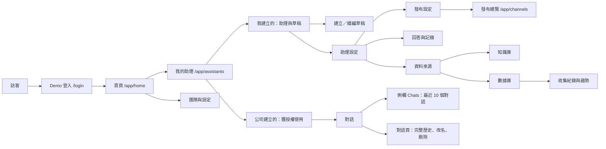

# Functional map｜AI 助理工作台

> 這份地圖描述目前的示範前端。資料與驗證主要保存在瀏覽器；官網嵌入與 LINE 仍是模擬流程。

| 區域 | 路徑 | 主要操作 | 可見條件 |
| --- | --- | --- | --- |
| Demo 登入 | `/login` | 使用 `admin`、`internal`、`customer` 與密碼 `1234` 登入 | 所有人 |
| 首頁 | `/app/home` | 開始新草稿、續編最近草稿、進入我的助理 | 已選 Demo 身分 |
| 我的助理 | `/app/assistants` | 查看我建立的助理和所有草稿、使用公司分享的助理 | 已選 Demo 身分；內容依權限過濾 |
| 建立助理 | `/app/assistants/new/purpose` | 每次進入建立獨立草稿 | 可管理助理的身分 |
| 續編草稿 | `/app/assistants/drafts/:draftId/:step` | 用途、來源、規則、試問、建立 | 草稿擁有者 |
| 助理設定 | `/app/assistants/:id/:tab` | 概覽、來源、規則、測試、發布、使用紀錄 | 助理擁有者 |
| 對話 | `/app/chat/:assistantId/:conversationId?` | 對話、完整歷史、改名、刪除 | 本人擁有或獲公司分享 |
| 知識庫 | `/app/knowledge[/:id/:tab]` | 清單、內容、連接助理、分享權限 | 擁有者或依分享權限 |
| 數據庫 | `/app/databases[/:id/:tab]` | 清單、Dialog 新增、表單、紀錄、趨勢、權限 | 依資料來源與紀錄權限 |
| 發布總覽 | `/app/channels` | 查看助理與管道狀態 | 助理擁有者；由發布設定進入 |
| 團隊與設定 | `/app/settings` | 團隊權限與外觀 | 團隊權限由管理身分控制 |

## 關鍵資料流

1. Demo 帳號對應既有的三個 `AccountId`。登入只建立分頁內的 Demo session，不連接後端。
2. 草稿以帳號及草稿 ID 隔離。舊版單份草稿首次讀取時轉入新清單；建立助理後只移除完成的那份草稿。
3. 公司建立的助理來自 `listUsableAssistants()` 的權限結果。助理擁有者仍可管理自己的助理。
4. Chats 只取目前帳號可使用的助理中、允許保存的對話，依 `updatedAt` 排序取前 10 筆；詳細操作在對話頁。
5. 知識庫與數據庫清單、助理資料來源共用 `libs/ui` 的 data-table。表格在狹窄畫面可水平捲動。
